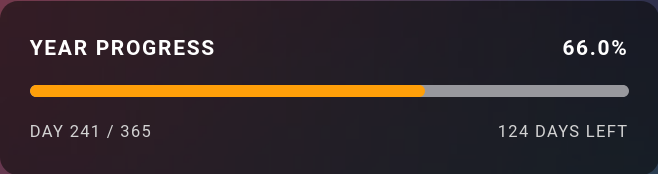
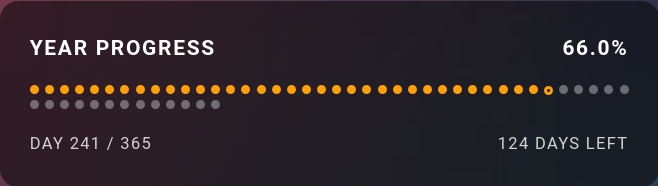
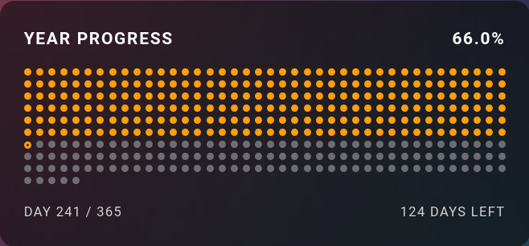

# Year Progress Card

A minimalist Home Assistant dashboard card that shows how much of the current year has elapsed. Choose a continuous bar, one dot per day, or one dot per week. The card follows Home Assistant theme colors and includes a visual configuration editor.

## Screenshots

These screenshots were captured using the `ios-dark-mode` theme.

### Continuous bar



### Weekly dots



### Daily dots



## Features

- Continuous progress bar, daily dots, or weekly dots
- Configurable percentage precision from 0–8 decimals, including once-per-second Insane mode
- Day count and days-remaining labels
- Monday or Sunday week start
- Adjustable bar height, dot size, spacing, padding, and corner radius
- Leap-year support and automatic refresh after midnight
- Native visual card editor; YAML remains fully supported

## Install with HACS

1. In HACS, open **Dashboard**.
2. Open the menu and choose **Custom repositories**.
3. Enter `https://github.com/cybearde/ha_year-in-progress`, choose **Dashboard** as the category, and add it.
4. Find **Year Progress Card** and select **Download**.
5. Refresh Home Assistant. If HACS does not add the resource automatically, add `/hacsfiles/ha_year-in-progress/ha_year-in-progress.js` as a JavaScript module under **Settings → Dashboards → Resources**.

## Manual install

Copy `dist/ha_year-in-progress.js` to `/config/www/ha_year-in-progress.js`, then add this dashboard resource:

```yaml
url: /local/ha_year-in-progress.js
type: module
```

Refresh the browser after updating the file.

## Add the card

Use the dashboard card picker and select **Year Progress Card**, or add YAML:

```yaml
type: custom:year-progress-card
mode: bar
title: YEAR PROGRESS
show_title: true
show_percentage: true
show_day_count: false
show_remaining: false
```

Daily dots:

```yaml
type: custom:year-progress-card
mode: days
dot_size: 8
dot_gap: 5
```

Weekly dots:

```yaml
type: custom:year-progress-card
mode: weeks
week_starts_monday: true
dot_size: 10
dot_gap: 7
```

## Options

| Option | Type | Default | Description |
| --- | --- | --- | --- |
| `mode` | string | `bar` | `bar`, `days`, or `weeks` |
| `title` | string | `YEAR PROGRESS` | Card heading |
| `show_title` | boolean | `true` | Show the heading |
| `show_percentage` | boolean | `true` | Show elapsed percentage |
| `decimal_places` | number | `1` | Percentage precision from `0` to `8`; values `6`–`8` refresh every second and `8` is Insane mode |
| `show_day_count` | boolean | `false` | Show current day and total days |
| `show_remaining` | boolean | `false` | Show days remaining |
| `bar_height` | number | `8` | Bar height in pixels |
| `dot_size` | number | `8` | Dot diameter in pixels |
| `dot_gap` | number | `5` | Gap between dots in pixels |
| `week_starts_monday` | boolean | `true` | Use Monday as the first weekday |
| `padding` | number | `20` | Card padding in pixels |
| `border_radius` | number | `12` | Card corner radius in pixels |

## Support and contributing

Please use GitHub Issues for bugs and feature requests. Pull requests are welcome. By participating, you agree to follow the [Code of Conduct](CODE_OF_CONDUCT.md).

## License

[MIT](LICENSE)
